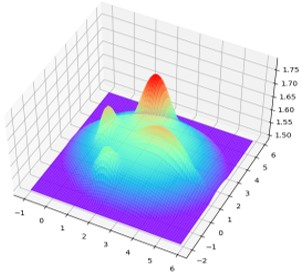
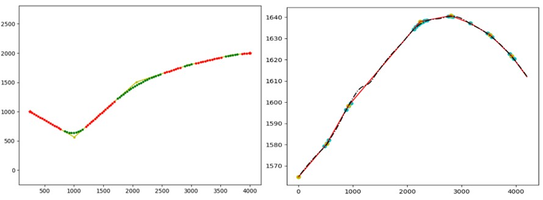
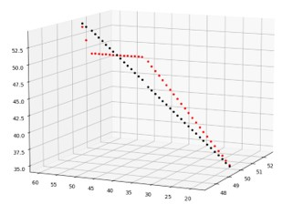

3D-CHA*: A Numerical Case Test
==========

|Author|Tianglong Zhang|
|---|---|
|E-mail|zhangtianlong1995@gmail.com|

### *Dependencies*
**********
Source code is implemented via Python 3.9 and does not rely on third-party software

### *Terrain Data*
**********
Test case terrain function is provided in the paper: 
https://onlinelibrary.wiley.com/doi/abs/10.1111/mice.12350

### *How to Run*
**********
1. Run generate_terrain.py and _generate_heuristic.py_ sequentially to generate two text files of terrain and heuristic cost. this module will also output a 3D terrain schematic, as shown in Figure 1 below.
 
__Figure 1 Numerical case topographic map__

2. Run _3D-CHAStar.py_ module, the program automatically generates the horizontal and vertical alignment shape, such as Figure 2. In addition, the program automatically outputs the horizontal intersection coordinates file (points.txt), the traversal points mileage file (bpd_lens.txt) and the slope file (slopes.txt).
 
__Figure 2 Generated 3D alignment__

### *Description of Other Modules*
**********
_get_cross_section_info.py_: Get fill, cut and corresponding cost information. See Figure 3.
 
__Figure 3 Cross_section calculation module__

_tool_functions.py_: Get the coordinates, hash and estimated cost of a new node